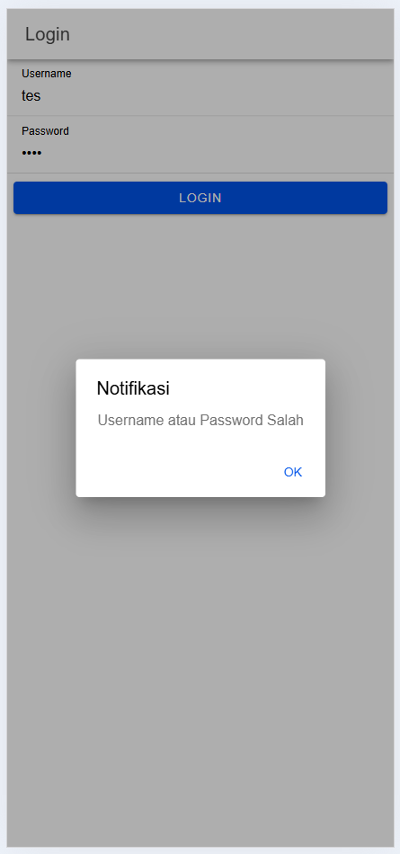

# Tugas 7 - Pertemuan 8

**Nama**  : Eka Belandini  
**NIM**   : H1D022002  
**Shift** : F

## Deskripsi Proyek

Proyek ini adalah pengembangan aplikasi mobile sederhana menggunakan framework Ionic dengan Angular. Aplikasi ini mencakup fitur login yang berfungsi untuk mengautentikasi pengguna sebelum mengakses halaman tertentu. Fitur ini dirancang untuk meningkatkan keamanan aplikasi dan memberikan pengalaman pengguna yang lancar.

## Fitur Utama

- **Form Login**: Pengguna dapat memasukkan username dan password.
- **Autentikasi**: Validasi kredensial pengguna dengan respons dari server.
- **Penyimpanan Token**: Menyimpan token autentikasi di `localStorage` untuk sesi pengguna.
- **Proteksi Halaman**: Mengamankan akses ke halaman penting dengan guard.
- **Navigasi Dinamis**: Pengalihan pengguna berdasarkan status autentikasi.

## Cara Kerja Login

### Alur Kerja

1. **Input Data Pengguna**: Pengguna memasukkan username dan password di form login.
2. **Pengiriman Data ke Server**:
   - Data dikirim melalui metode HTTP POST ke endpoint server autentikasi.
3. **Proses Validasi di Server**:
   - Server memproses data yang diterima dan memeriksa apakah username dan password valid.
   - Jika valid, server mengembalikan token autentikasi (misalnya, JWT).
   - Jika tidak valid, server mengembalikan pesan kesalahan.
4. **Penyimpanan Token**:
   - Jika login berhasil, token disimpan di `localStorage` atau `sessionStorage` untuk digunakan selama sesi pengguna.
5. **Navigasi Setelah Login**:
   - Aplikasi mengarahkan pengguna ke halaman utama (dashboard) setelah autentikasi berhasil.
6. **Proteksi Halaman**:
   - Halaman tertentu dilindungi dengan guard (`canActivate`) yang memeriksa keberadaan token sebelum mengizinkan akses.

### Struktur File

- **auth.service.ts**:
  - Berisi metode `login()` yang mengirimkan permintaan autentikasi ke server dan menangani respons.
- **login.page.ts**:
  - Komponen yang menangani logika form login, seperti memanggil service autentikasi dan mengatur navigasi berdasarkan hasil login.
- **login.page.html**:
  - Template yang menampilkan form login dengan input untuk username dan password, serta tombol submit.
- **app-routing.module.ts**:
  - Mengatur rute aplikasi dan menentukan halaman mana saja yang dilindungi oleh guard.

## Demo Aplikasi

### Screenshot Halaman Login


### Screenshot Gagal Login


### Screenshot Halaman Utama


## Cara Menjalankan Aplikasi

1. **Instalasi Ionic**:
   - Pastikan Anda sudah menginstal Ionic CLI. Jika belum, instal dengan perintah:
     ```bash
     npm install -g @ionic/cli
     ```
2. **Clone Proyek**:
   - Clone repository proyek ke komputer Anda:
     ```bash
     git clone https://github.com/username/nama-repository.git
     ```
3. **Instalasi Dependensi**:
   - Masuk ke direktori proyek dan instal dependensi:
     ```bash
     cd nama-repository
     npm install
     ```
4. **Menjalankan Aplikasi**:
   - Jalankan aplikasi di browser dengan perintah:
     ```bash
     ionic serve
     ```
